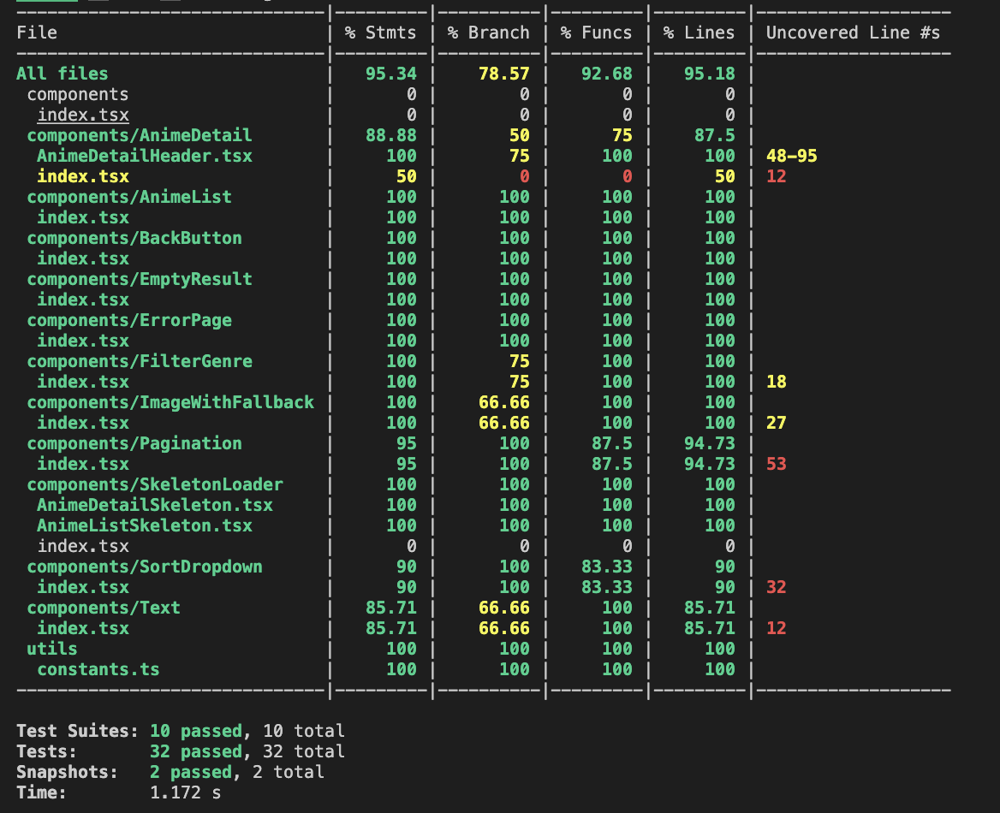

# Anime List App

## Development Tools

- **Next.js**, Framework.
- **Tailwind**, CSS Framework.
- **RTK Query**, Query Tools.
- **Jest**, Unit Testing Tools.

## Installation

1. Clone the repository

```bash
# using ssh
git clone git@github.com:Masagis/next-anime-list.git
# using https
git clone https://github.com/Masagis/next-anime-list.git
```

2. Install dependencies

```bash
npm install
```

3. Run the development server

```bash
npm run dev
```

## Project Structure

```bash
├── __mocks__                               # Mock Data for testing
├── __tests__                               # Unit test file
├── pages                                   # pages/route system
│   ├── anime
        ├── [id].tsx                        # AnimeDetail page
    ├── _app.tsx
    ├── _document.tsx
    ├── index.tsx                           # Landing Page or Anime List
├── components                              # Components directory
    ├── AnimeDetail
    ├── AnimeList
    ├── AnimeList
    ├── ...
├── hooks
    ├── useDebounce.ts                      # debounce hooks for input
    ├── usePaginationAndSearch.ts           # pagination hooks for pagination component
├── redux
    ├── store.ts                            # redux store for store every query
    ├── services                            # service directory to query and the types
        ├── anime.ts
        ├── types
            ├── anime.ts
├── utils
    ├── constants.ts


```

## Features

- Anime list with pagination
- Search functionality
- Sort and Filter Functionality
- Anime detail page

## Bonus

- Caching: Use RTK Query to cache same query to improve UX
- Responsive: Responsive app (desktop, tablet, and mobile)

## Unit Test Coverage Result


